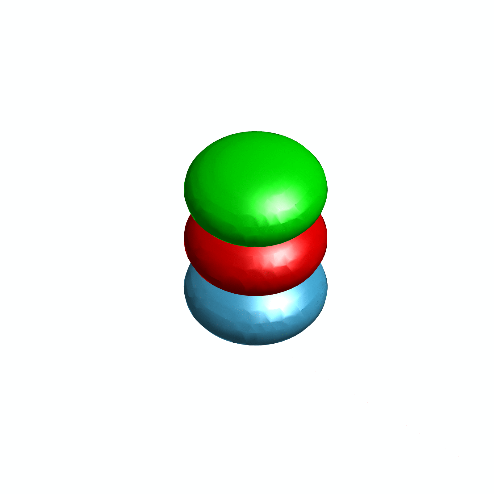

<b>Authors:</b> Y. Wu, <b>Z. Qiu</b>, J. Yang

This paper presents a three-dimensional multi-phase-field vesicles model and discusses its practical finite difference solver. It is currently published in Computer Physics Communications (CPC).

**[Free Access]** Elsevier provides 50 days of free access to the final version. You can download the full paper **for free** via [this link](https://authors.elsevier.com/c/1mWXh2OInzQhY) (**valid until March 19, 2026**).

**Main Contributions:**
* Implemented a hybrid numerical solver for 3D fluid vesicle dynamics in C++, integrating phase-field models into an existing simulation framework.
* Applied a semi-implicit finite difference scheme to evolve phase-field equations, ensuring rigorous numerical stability and energy conservation.
* Optimized memory management and data storage strategies, significantly reducing computational overhead for multi-vesicle interaction simulations.

<table style="border: none; width: 100%; margin-top: 20px;">
  <tr style="border: none;">
    <td width="50%" style="border: none; text-align: center; vertical-align: top; padding: 10px;">
      
      

        Phase-field simulation of 8 spherical vesicles with 2 phase-field variables.
      

    </td>
    <td width="50%" style="border: none; text-align: center; vertical-align: top; padding: 10px;">
      
      

        Phase-field simulation of 3 stacked vesicles with distinct phase-field variables.
      

    </td>
  </tr>
</table>